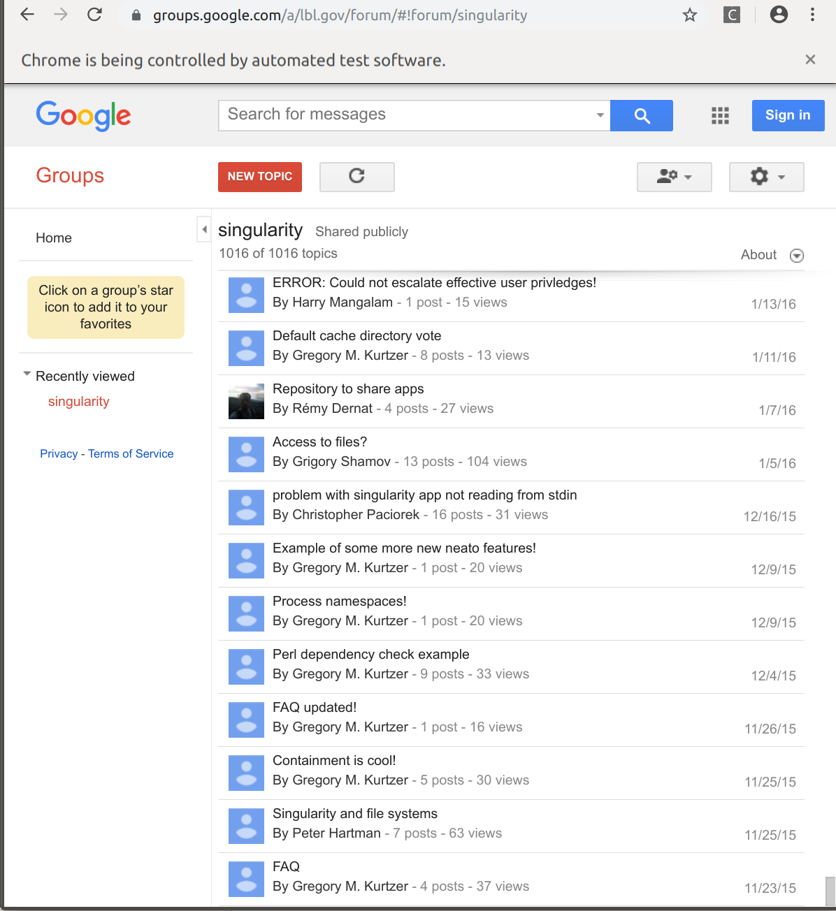

# Google Group Scraper

This is a derivation of an old set of scripts that I derived in graduate school (2017 possibly?),
lost for a few years, and amazingly found on a USB drive! I refactored them
to work with (what seems to be) a slightly different Groups interface.
You need to use Python 3, because I haven't thought about Python 2 compatability.
Using this module relies on being able to see all the posts, as it's been developed
using a public group (which I'm a member of). This should work to export
correspondence from a Google group into text files, for doing whatever you please with.

Yes, this is definitely hacky, but (at least for today) it's working for me!

## Usage

The only arguments that are needed are the organization (e.g., 'a/lbl.gov')
and the group name (e.g., singularity). 

```bash
$ python scrape.py --help
usage: scrape.py [-h] org group

Google Group Scraper

positional arguments:
  org         the name the organization (e.g., a/lbl.gov)
  group       the name of the Google Group (e.g., singularity)

optional arguments:
  -h, --help  show this help message and exit
```

You can provide them as the first
and second positional argument as follows:

```python
$ python scrape.py a/lbl.gov singularity
```

You'll need Chrome, as we use the chromedriver included in this repository.
If you have Chrome, you'll see a window open that is being controlled by 
"automated test software." In the window that you are running the script,
 you'll see an instruction:

```bash
$ python scrape.py a/lbl.gov singularity
/home/vanessa/Documents/Dropbox/Code/Python/GoogleGroupScraper/exports/a-lbl.gov/singularity/2019-10-21 already exists, will only get new topics.
Output: /home/vanessa/Documents/Dropbox/Code/Python/GoogleGroupScraper/exports/a-lbl.gov/singularity/2019-10-21
Scroll to the bottom (the first post) and press Enter to continue...
```

And this is exactly what you need to do - in the browser, scroll (page down is fast)
to the absolute bottom of the forum. Yes, this means in many cases posts from 2015
or earlier! Here is the bottom of the Singularity forum:



Once you've scrolled to the bottom and pressed enter, it will proceed to
extract the messages from the topic threads.

```bash
...
/home/vanessa/Documents/Dropbox/Code/Python/GoogleGroupScraper/exports/a-lbl.gov/singularity/2019-10-21 already exists, will only get new topics.
Output: /home/vanessa/Documents/Dropbox/Code/Python/GoogleGroupScraper/exports/a-lbl.gov/singularity/2019-10-21
Scroll to the bottom (the first post) and press Enter to continue...
Found 1016 topics links on forum
Obtained 3 raw urls.
Obtained 4 raw urls.
```

## Concepts

Before we talk about output files, let's review some basic concepts that will
help us define the output organization.

 - *topics/threads* are akin to posts. When I post to the list, I create a new topic. This is also sometimes referred to as a thread, because a topic is a thread of one or more messages.
 - *messages* are sub sections of topics. The first message is my original post, and if you respond, that would be a new message.
 - *forum* is the entire set of topics

## Output

Thus, we are going to organize output based on the organization and group, along
with the date and thread id and message id.

```
# exports/<org>/<group>/<date>/topics/<thread_id>/<message_id>
# exports/<org>/<group>/<date>/urls.txt
```

A real example might look like this:

```
exports/
└── a-lbl.gov
    └── singularity
        ├── 2017-03-31
        │   ├── group.json
        │   ├── README.md
        │   └── urls.txt
        └── 2019-10-21
            ├── topics
            │   ├── 1BUYcwzc2ww.txt
            │   │   ├── DNGGUjnxFQAJ.txt
            │   │   └── gYYrT5uXAwAJ.txt
...
            │   └── zcoOui_RoAo.txt
            │       ├── 5x9MQ9VbDAAJ.txt
            │       ├── cBniyJB4DAAJ.txt
            │       ├── frM-tvYSDQAJ.txt
            │       ├── K6lcgar6DAAJ.txt
            │       ├── PBZxW3kgDAAJ.txt
            │       └── q9BoZwEuDAAJ.txt
            └── urls.txt

```

If you look at any particular file, it's the entire content of the email message.
So likely you'll need to parse that further, either to extract text content,
or do some kind of fun natural language processing project.

That's basically it! You can look at the included export for an example.
